# BhooAI Nexus

Build full-stack Node.js applications with one CLI and one configuration file. BhooAI Nexus includes an HTTP server, WebSockets, GraphQL federation, MongoDB data access, authentication, CSRF/CORS protection, payments, email, WebRTC, Python AI services, plugins, an admin console, and master/slave cluster orchestration.

## Features

- Node.js HTTP server with trie routing, middleware, uploads, static files, security headers, CORS, CSRF, and rate limiting
- MongoDB ODM with schemas, hooks, indexes, populate, and transactions
- JWT access tokens, refresh tokens, sessions, Google OAuth, Facebook OAuth, and role-based access control
- WebSockets, Redis adapters, WebRTC signaling, and mediasoup SFU integration
- GraphQL subscriptions, federation composition, entity joins, `@provides`, and `@requires`
- Razorpay, PayPal, PayU, Skrill, and Payoneer integrations
- Email, certificate generation, Redis cache, Google Ads, and plugin extensions
- Python FastAPI AI server with OpenAI-compatible chat, embeddings, Ollama, and SSE streaming
- Admin console with configuration, environment, process, monitoring, database, AI, and cluster management
- Master/slave cluster mesh with load balancing, node agents, request allocation, health checks, and upload path pinning
- Tailwind CSS + `@bhooai/nexus-postcss` preset with PostCSS pipeline, design tokens, light/dark theme, and CSS playground

## Requirements

- Node.js `>=22`
- npm, included with Node.js
- MongoDB 6 or newer, running locally or reachable through `MONGODB_URI`
- Redis 6 or newer, running locally or reachable through `REDIS_URL`
- Python 3.13 or newer for the optional AI server
- A virtual environment is recommended for Python dependencies

The Python service dependencies are listed in [`apps/ai-server/requirements.txt`](apps/ai-server/requirements.txt): FastAPI, Uvicorn, HTTPX, pytest, and pytest-asyncio.

MongoDB and Redis can be started with Docker, system services, or managed cloud providers. The AI server is optional when AI features are not used.

## Install

```bash
npm install bhooai-nexus
npx nexus init my-app
cd my-app
npm run doctor
npm run dev
```

Initialize the current directory with `npx nexus init .`. Use `npx nexus init . --skip-install` to defer dependency installation.

## Quick Start

```bash
npm install bhooai-nexus
npx nexus init my-app
cd my-app
npm run doctor
npm run dev
```

Default development services:

| Service | Default port |
| --- | ---: |
| Backend API | `4000` |
| Frontend | `3000` |
| Admin console | `3300` |
| Python AI server | `8000` |
| Cluster load balancer | `8080` |
| Node agent | `7575` |

`nexus dev` automatically moves a configured port to the next available port, allowing master and slave projects to run side by side on one machine.

## Screenshots

### Admin login


### Overview dashboard

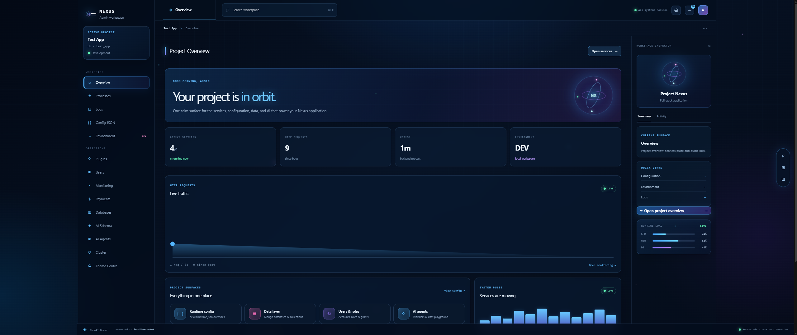

### Master cluster management

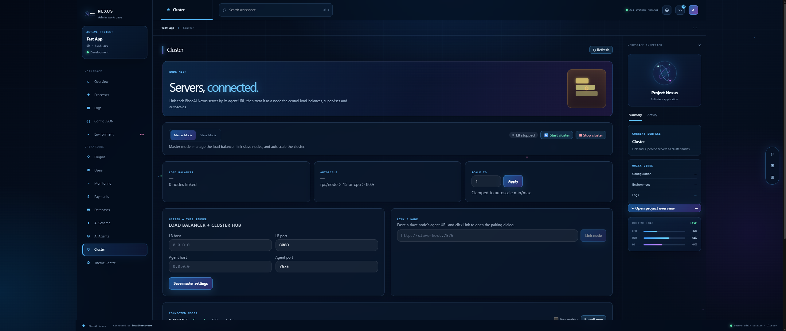

### Slave node agent and roles

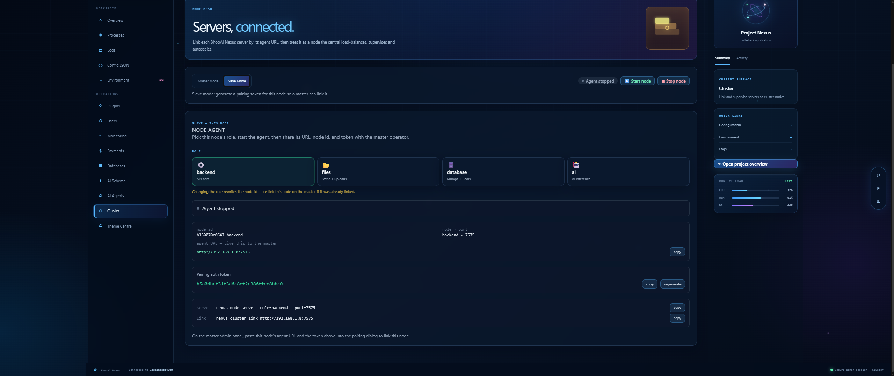

### Connected cluster nodes

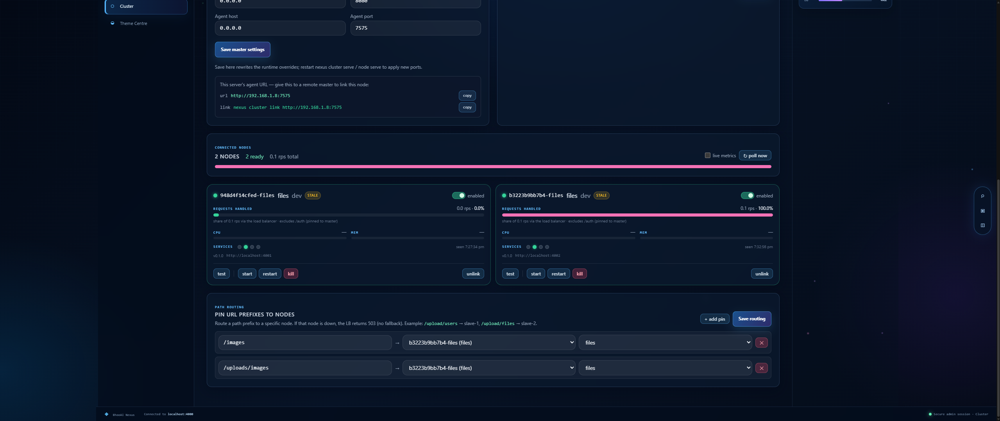

### AI agents

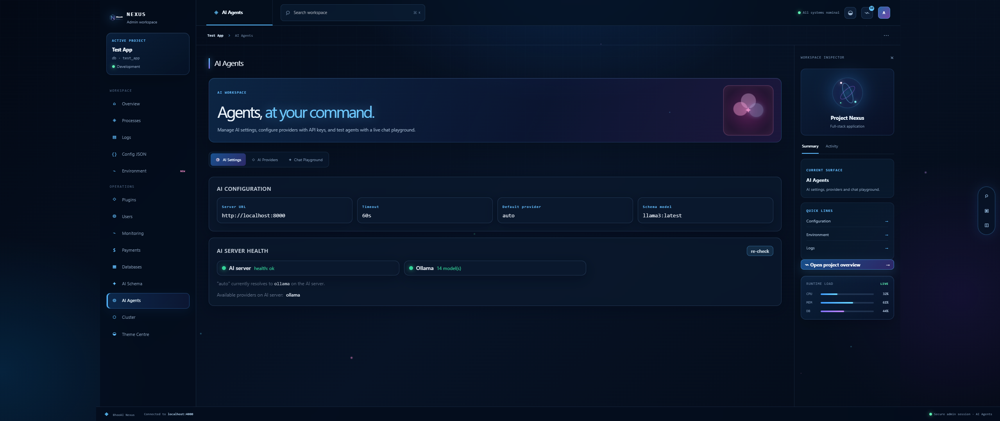

### AI providers

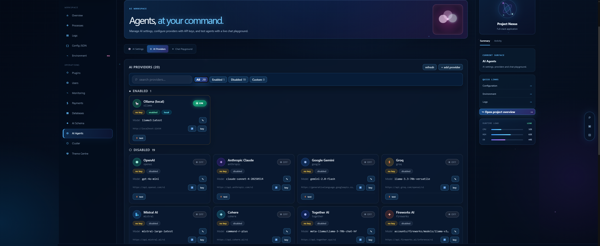

### AI playground

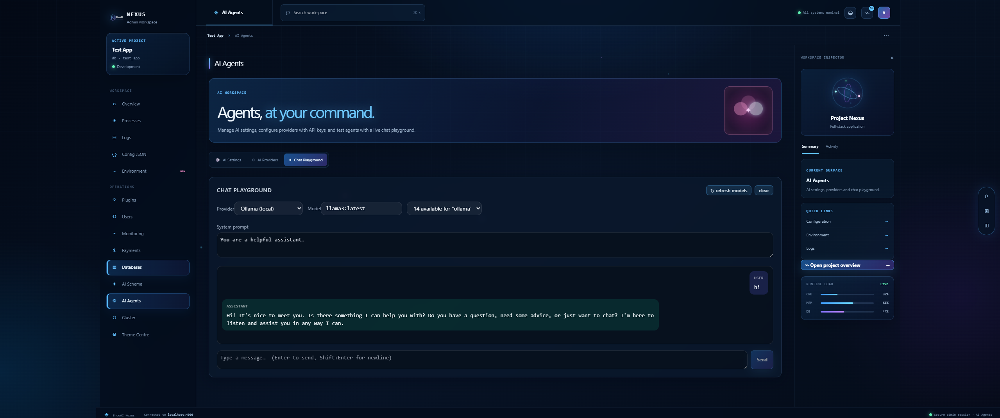

### Monitoring

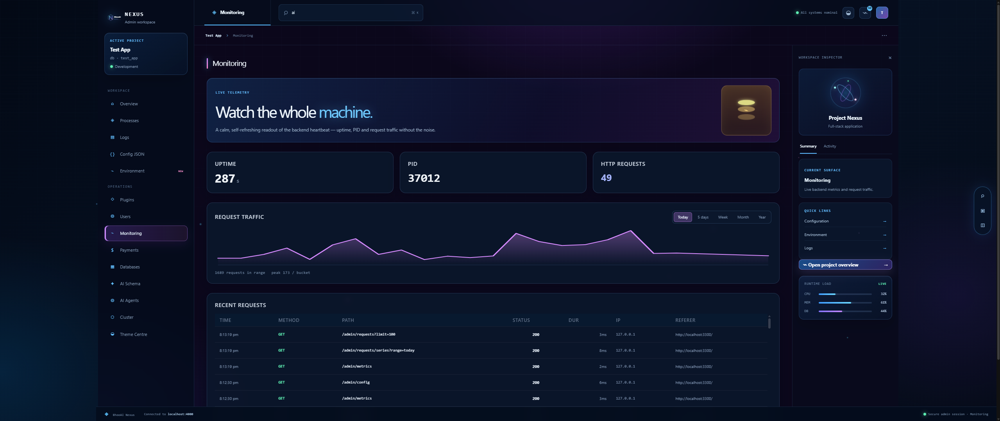

### Settings

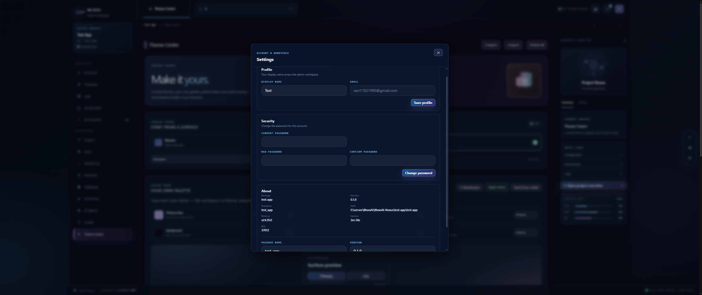

### Themes

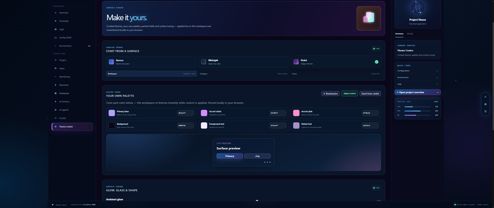

### Appearance

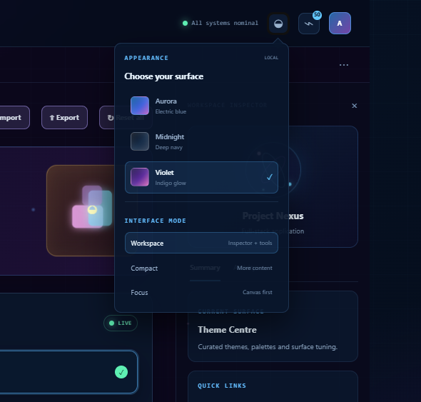

### Search

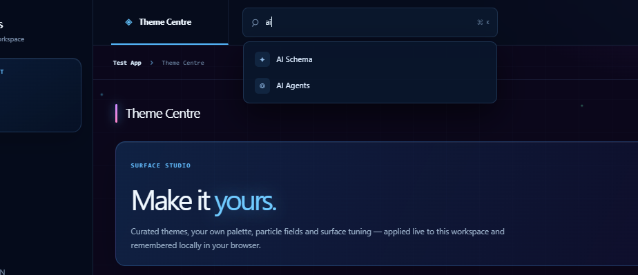

### Notifications

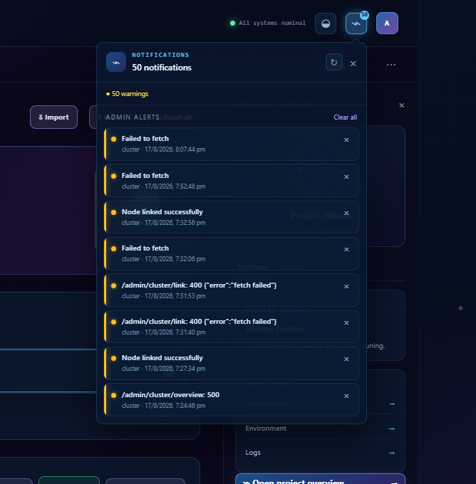

### AI log summary

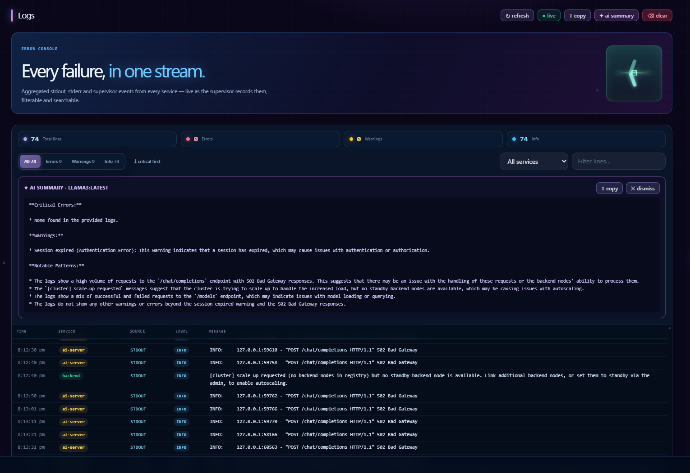

### Nexus development services

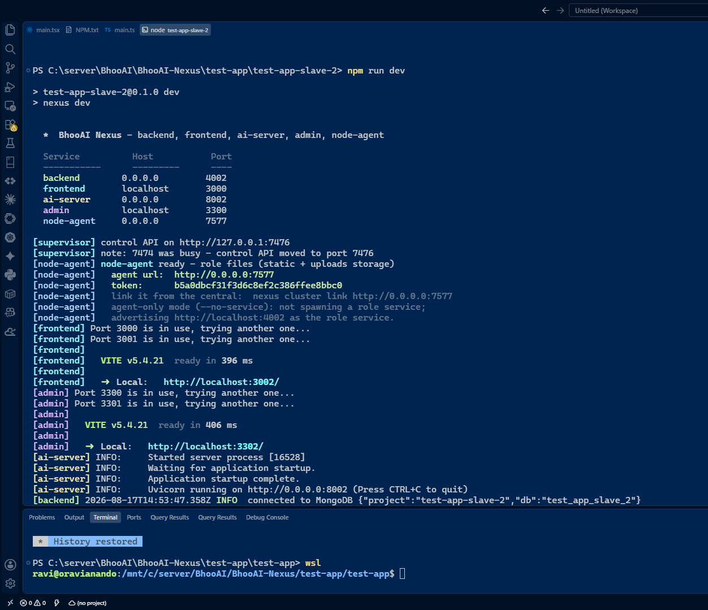

### Nexus initialization

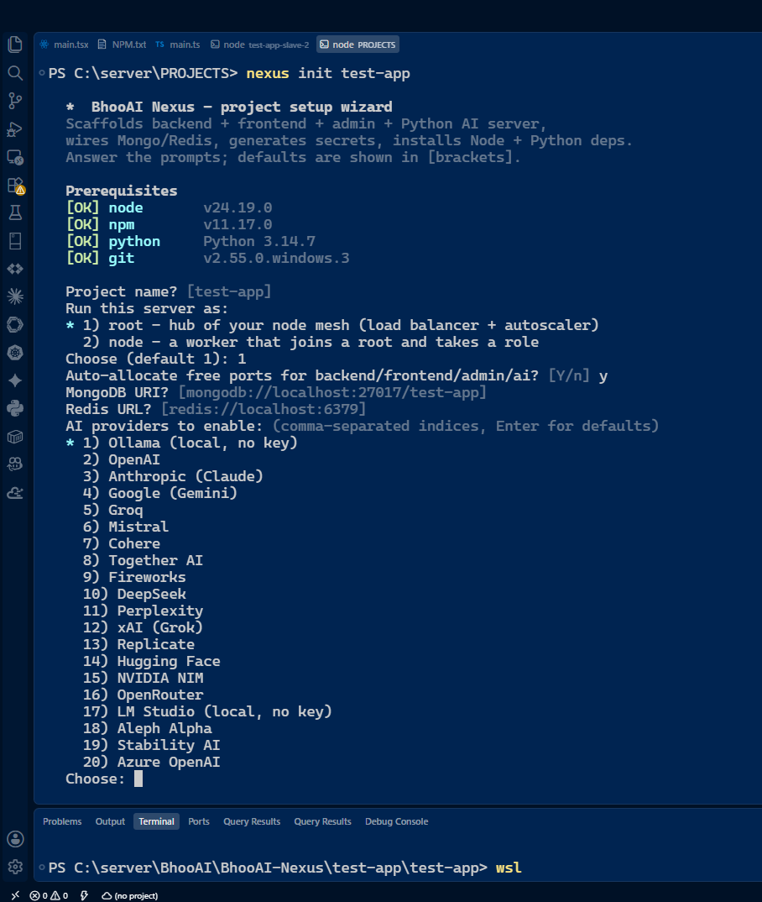

## Cluster Mesh

BhooAI Nexus supports a central master and one or more slave nodes.

Initialize a master:

```bash
npx nexus init master --as=root
```

Initialize a slave with a built-in role:

```bash
npx nexus init slave-1 --as=node --role=backend --port=7575
npx nexus init slave-2 --as=node --role=files --port=7576
```

Supported node roles are `backend`, `files`, `database`, and `ai`.

After `npm run dev`, a node project automatically starts its node agent. The agent exposes the control API and advertises the node's development backend without starting a duplicate backend process.

The master load balancer listens on port `8080` and distributes traffic across ready backend nodes. Authentication routes are pinned to the master:

- `/auth/*`
- `/csrf-token`

Use the same `NEXUS_AUTH_JWT_SECRET` on all nodes so slaves can verify master-issued access tokens.

### Upload path allocation

The master admin console includes **Cluster → Path routing**. Pin URL prefixes to specific nodes:

```text
/uploads/images  ->  slave-1
/uploads/files   ->  slave-2
```

Path pins use longest-prefix matching. A pinned request is sent only to its configured node. If the pinned node is unavailable, the load balancer returns `503 pinned_node_down` instead of silently sending the request to another node.

When no slave nodes are linked, the load balancer fails open to the master's own backend if `cluster.failOpenSingleNode` is enabled. This keeps a cluster-enabled master usable as a single-node installation.

Upload endpoints accept both `/uploads` and sub-paths such as `/uploads/images`. The upload directory is created automatically on the node that handles the request.

## Admin Console

Open the admin console at `http://localhost:3300` during development. The console provides overview, processes, logs, configuration, environment, plugins, users, monitoring, payments, databases, schema, AI, and cluster management.

The Cluster tab includes connected-node cards with request allocation percentage, CPU, memory, freshness, service health, test, enable, restart, and unlink controls. Slave mode includes role selection, node-agent status, pairing tokens, node IDs, and copyable serve/link commands. Master mode includes path-prefix routing for uploads and other services.

## Configuration

Edit `nexus.config.ts`. Configuration precedence is:

```text
code defaults < nexus.config.ts < nexus.runtime.json < NEXUS_* environment variables < CLI flags
```

Admin changes are written to the gitignored `nexus.runtime.json` file. Store secrets in the project `.env` file:

```env
MONGODB_URI=mongodb://localhost:27017/my-app
REDIS_URL=redis://localhost:6379
NEXUS_AUTH_JWT_SECRET=replace-with-a-long-random-secret
```

Common port overrides include `NEXUS_SERVER_PORT`, `NEXUS_FRONTEND_PORT`, `NEXUS_ADMIN_PORT`, `NEXUS_CLUSTER_LBPORT`, `NEXUS_CLUSTER_NODEAGENTPORT`, and `AI_PORT`.

## CSS Pipeline

Every scaffolded frontend and admin app ships with Tailwind CSS and the framework-owned `@bhooai/nexus-postcss` preset. The preset loads six PostCSS plugins in one curated pipeline:

1. `postcss-import` — `@import` resolution
2. `postcss-nested` (or `postcss-nesting` with `nestingMode: 'modern'`) — CSS nesting
3. `tailwindcss` — base/components/utilities + content scanning
4. `postcss-preset-env` (stage 2) — future CSS features today
5. `autoprefixer` — vendor prefixes
6. `cssnano` — minification (production only)

### PostCSS preset options

```js
import { createPreset } from '@bhooai/nexus-postcss';
import forms from '@tailwindcss/forms';
import typography from '@tailwindcss/typography';

export default createPreset({
  tailwindPlugins: [forms, typography],  // Tailwind plugins
  nestingMode: 'modern',                 // spec-compliant CSS nesting
  logical: true,                          // RTL/LTR direction-aware CSS
  sourcemap: true,                        // inline source maps
  engine: 'lightningcss',                // ~100x faster (experimental)
});
```

### Design tokens

Two token stylesheets ship with the preset:

- `@bhooai/nexus-postcss/theme.css` — 22 `--nexus-*` dark theme tokens + 15 `--admin-*` aliases
- `@bhooai/nexus-postcss/theme-light-dark.css` — dual-theme variant using CSS `light-dark()` for automatic light/dark switching

```css
@import '@bhooai/nexus-postcss/theme.css';

:root {
  --nexus-accent: #ff6b6b;  /* retheme any token */
}
```

See the [PostCSS API reference](docs/api/postcss.html) and the [Frontend Styling guide](docs/guides/guide-frontend-styling.html) for full documentation, including a live CSS playground.

## Uninstall

Preview changes:

```bash
npx nexus uninstall --dry-run
```

Remove the project database and registration while keeping files:

```bash
npx nexus uninstall
```

Remove the database, registration, and project directory:

```bash
npx nexus uninstall --purge
```

Skip confirmations or keep the database:

```bash
npx nexus uninstall --purge --force
npx nexus uninstall --keep-db
```

Uninstall does not remove the framework package, MongoDB's `nexus_projects` database, or other projects.

## Project Layout

```text
packages/       17 framework packages (@bhooai/nexus-*)
apps/backend/   Node.js backend
apps/frontend/  React + Vite frontend
apps/admin/     React + Vite admin host
apps/ai-server/ Python FastAPI AI service
bin/            CLI entry point
contracts/      Node-to-Python API contracts
plugins/        Project plugins
tests/          Cross-service tests
docs/           Architecture, guides, API reference, and screenshots
```

### Framework packages

| Package | Description |
| --- | --- |
| `@bhooai/nexus-core` | HTTP server, trie router, config stack, DI container |
| `@bhooai/nexus-auth` | CSRF, CORS, security headers, rate limit, JWT, OAuth2, sessions, RBAC |
| `@bhooai/nexus-data` | Custom ODM on the native mongodb driver |
| `@bhooai/nexus-graphql` | Federation, supergraph, subscriptions — no Apollo |
| `@bhooai/nexus-realtime` | WebSocket rooms, WebRTC signaling, mediasoup SFU |
| `@bhooai/nexus-payments` | Razorpay, PayPal, PayU, Skrill, Payoneer + webhooks |
| `@bhooai/nexus-email` | SMTP, templates, Redis-backed outbound queue |
| `@bhooai/nexus-crypto` | RSA/ECDSA keys, X.509 certs, CSRs, HTTPS/mTLS |
| `@bhooai/nexus-cache` | Redis cache-aside, rate limiter, pub/sub |
| `@bhooai/nexus-ads` | Google Ads client with GAQL query builder |
| `@bhooai/nexus-plugins` | In-process + sandboxed worker-thread plugins |
| `@bhooai/nexus-ai-client` | Node client for the Python AI server — SSE, retries, timeouts |
| `@bhooai/nexus-cluster` | Node agent, mesh registry, load balancer, autoscaler |
| `@bhooai/nexus-telemetry` | Structured logger, metrics, trace/request-ID propagation |
| `@bhooai/nexus-safe-goto` | Safe external-link dialog — anti tab-nabbing/phishing |
| `@bhooai/nexus-postcss` | PostCSS preset — Tailwind, nesting, preset-env, autoprefixer, cssnano |
| `@bhooai/nexus-cli` | init wizard, doctor, dev supervisor |

## Testing

```bash
npx vitest run
cd apps/ai-server
python -m pip install -r requirements.txt
pytest
```

Run Playwright end-to-end tests from the framework root:

```bash
npx playwright test --config=playwright.config.ts
```

## Docker

```powershell
.\docker.ps1 build
.\docker.ps1 run
.\docker.ps1 logs
.\docker.ps1 stop
```

Development endpoints are frontend `http://localhost:3000`, admin `http://localhost:3300`, and backend `http://localhost:4000/health`.

## Documentation

- [`docs/ARCHITECTURE.md`](docs/ARCHITECTURE.md) — architecture and data flow
- [`docs/IMPROVEMENTS.md`](docs/IMPROVEMENTS.md) — improvement history and next steps
- [`docs/troubleshooting.html`](docs/troubleshooting.html) — common errors and fixes
- [`docs/api/postcss.html`](docs/api/postcss.html) — PostCSS preset API reference + CSS playground
- [`docs/guides/guide-frontend-styling.html`](docs/guides/guide-frontend-styling.html) — frontend styling guide with live preview
- [`docs/screenshots/README.md`](docs/screenshots/README.md) — screenshot catalog
- [`apps/ai-server/README.md`](apps/ai-server/README.md) — Python AI service
- Package documentation under `packages/nexus-*/README.md`

## Design Principles

BhooAI Nexus avoids Apollo, Express, and Mongoose where direct control is required. The HTTP server, trie router, ODM, federation layer, plugin sandbox, and PostCSS preset are implemented in the workspace. Established libraries are used for standards and infrastructure, including GraphQL.js, MongoDB, Redis, WebSockets, Nodemailer, Jose, mediasoup, Tailwind CSS, and Lightning CSS.

## License

BhooAI Nexus is released under the [MIT License](LICENSE).